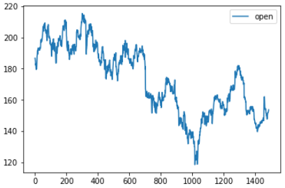
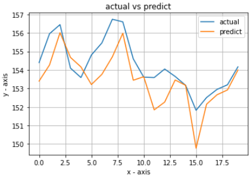
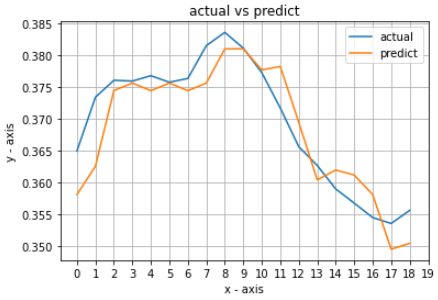
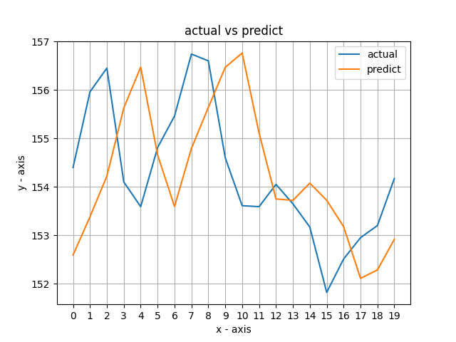
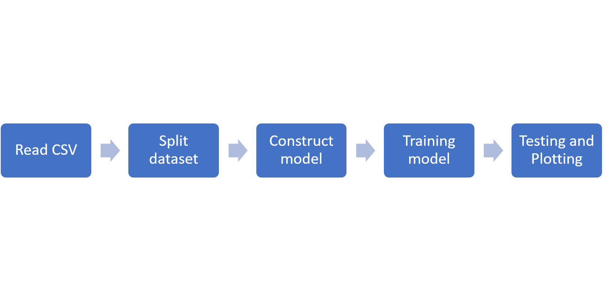

# DSAI HW2 Auto Trading
NCKU DSAI course homework 2 - Auto Trading

## Execution
```shell
python main.py --training ../data/training.csv --testing ../data/testing.csv --output ../output_file/submission.csv
```
## Requirements
```shell
pip install -r requirements.txt
```

---
## Prologue
#### Homework Description:
[[Link](https://paper.dropbox.com/doc/HW2-AutoTrading--BHH8hK5eWueIZLKBBo~~CtZ3AQ-z7Ke9N2AUZQnPf5NG3ZOt)]

#### Goal:
To maximize the profit by training a model to predict future stock price.

---
## Dataset
Training Dataset contain five years trading data of NASDAQ: IBM. Testing data contain 20 days data. It is a sequential data after the training dataset. Both of the data contain [open, high, low, close] values on each day.
[[Stock Reference](https://paper.dropbox.com/doc/DSAI-HW2-AutoTrading-z7Ke9N2AUZQnPf5NG3ZOt)]

The open price data in training dataset.



---
## Trading Strategy
The stock you holded must between -1 ~ 1.
```python
if tomorrow_price > today_price:
    if self.stock == 0:
        action = self.buy
        self.stock += 1
    elif self.stock == 1:
        action = self.hold
    elif self.stock == -1:
        action = self.buy
        self.stock += 1
    else:
        sys.exit("There's some mistake!!")
elif tomorrow_price == today_price:
    action = self.hold
else:
    if self.stock == 0:
        action = self.sell
        self.stock -= 1
    elif self.stock == 1:
        action = self.sell
        self.stock -= 1
    elif self.stock == -1:
        action = self.hold
    else:
        sys.exit("There's some mistake!!")
```
---
## Experiment
### XGBRegressor
We are trying to find the best model for this problem. First, we test xgb. We use XGBRegressor to predict the tommorow stock price. The result is actually really bad so we didn't even bother to plot out the result.
Than we use 5 days open price before tommorow as the training features. We can see that this time the model has a better predition. Despite the values was not even close to the real value, the model still catch the trend.


Next, we add 5 days close vales before tommorow as part of the training features. We expect to get a better performance. We did get a better curve, judging by the charts. But it is actually even worse than we thought when we put our action into the StockProfitCalculator. We got -0.7 as the output of StockProfitCalculator.


We have conduct another experiment by using XGBRegressor. We calculate 5 days mean before tommorow. By using the sliding window technique. We can get each 5 days mean values as training features.
This time we have a totally different charts, and we have a better profit values as well. We got 0.3 as profit value but it was not good enough. At this point we would like to change our model. This version is the final XGBRegressor in our code.



### LSTM
After we done with XGBRegressor, we conduct a survey on stock price prediction models. We observe that using Deep Learning model are more common nowadays.
We use LSTM as our training model instead of traditional machine learning model.
The way that training LSTM model is totally different from XGBRegressor. We have to slice our training data into groups. Each group contain a certain amount of data that as input. For output we expect as one values. So in this case, the input data will be the data before tommorow. It may be 1 or 5 or 300 as your setting. In our case, we pick 300 days before prediction day. For output data, it will be a single value as tommorow price prediction. This time we finally got a proper curve and proper prediction values. After that, we have a pretty good prediction value  after we put our output action into StockProfitCalculator.
### Model structure

### Result plot

---
## Program procedure


---
## Result Profit : [10.02](./StockProfitCalculator)
The result that using TA stock profit calculator.
